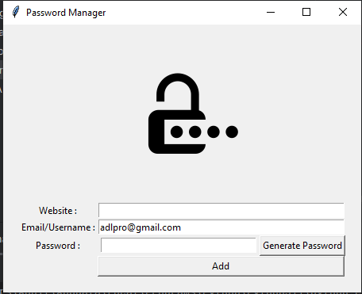
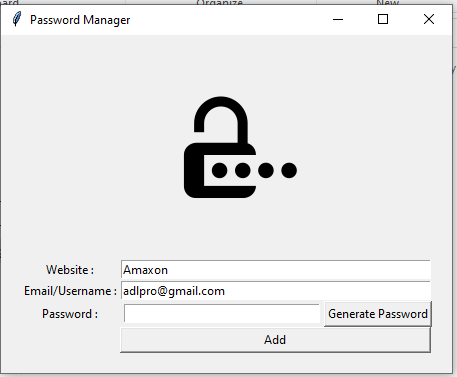
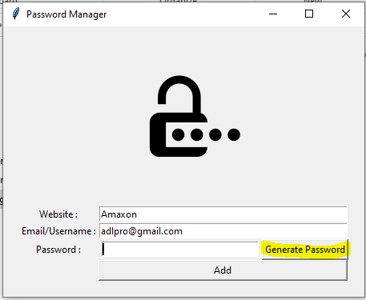
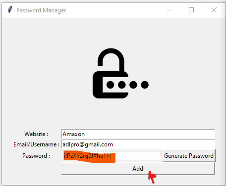
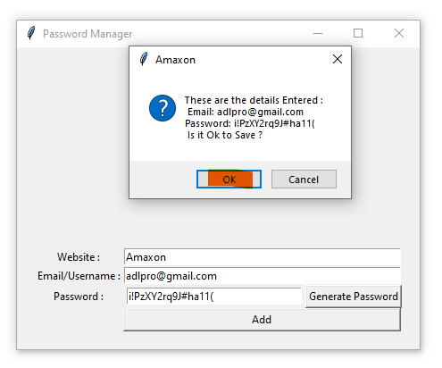
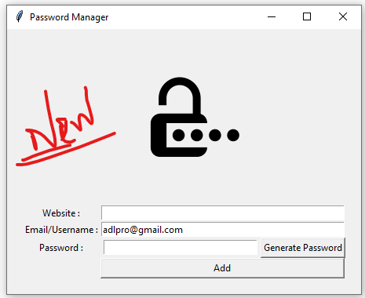
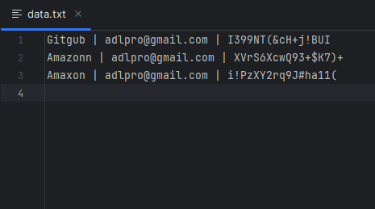

# Passager - Password Manager

Passager is a simple password manager that helps you create and store secure passwords for various websites and services.

## Table of Contents
- [Features](#features)
- [Installation](#installation)
- [Screenshots](#screenshots)


## Features

- **Password Generation**: Automatically generate strong and secure passwords.
- **Clipboard Support**: Easily copy passwords to the clipboard for quick access.
- **Data Storage**: Store website URLs, usernames, and passwords in a text file for future reference.

## Installation

1. Clone the repository to your local machine:

   ```bash
   git clone https://github.com/Adhil03/Passager.git


## Screenshots
Run Code to Open this Passager, and It looks like below figure.

It contains default Email, and if you want to change, click to Edit it easily

Enter website name, In this case eg: Amaxon. 

 and go to Password. you like put your own password, just enter your Password, otherwise simply click 
"generator password" to generate strong password.

Generated Random Strong Password is shown in password field, you can see in below screenshot.

Once you Ok with password, then click Add Button, to open message window.
If you want Edit, then click cancel and Edit it and then click again Add button to display again
this message window. Now Is it OK to Save -> click Ok to saved in your password in "data.txt" file.

Once you hit the Add button Data Added and refers the Passager. Then You can Add More Passwords.

Saved data looks like below, and It opens with Any .txt Viewer, like : Notepad.exe



1. Clone the repository to your local machine:

   ```bash
   git clone https://github.com/Adhil03/Passager.git

## Adhil03
